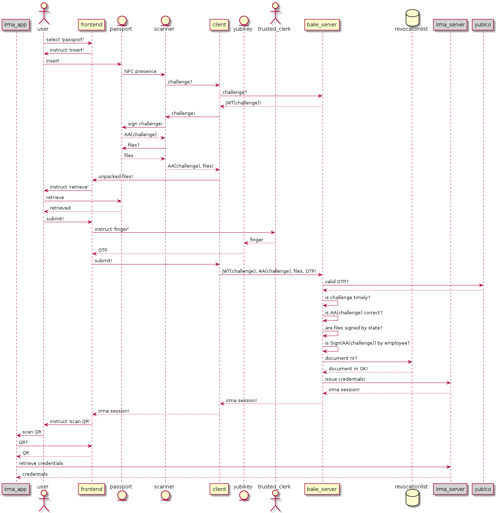

# IRMA balie
Machine Readable Travel Document scanner for IRMA Proof of Concept.

Developed for the municipality of Amsterdam.



## How to start (preliminary)

Build the docker images:
```bash
docker-compose build
```

Start a ngrok:
```bash
ngrok http localhost:8088
```

This will tell you that you have a hostname. This is your IRMA host. Use the HTTPS one:
```bash
export IRMA_URL=http://ce71d175bf36.ngrok.io
```

Now in that terminal run:
```bash
docker-compose up
```

## How to debug

Visit the [client hostname](https://client.balie.test.tweede.golf/create) to ensure that the self-signed cert is accepted.

You can connect a websocket to the client to get the progress:
```javascript
let f = () => { ws = new WebSocket("wss://client.balie.test.tweede.golf/socket"); ws.onmessage = (msg) => console.log('msg', JSON.parse(msg.data)) }; f()
```

Then in a REST API tester you can perform the following requests:
1. Create a session: [https://client.balie.test.tweede.golf/create](https://client.balie.test.tweede.golf/create)
2. Push your document as a `application/json` POST message: [https://client.balie.test.tweede.golf/scanned](https://client.balie.test.tweede.golf/scanned)
3. Press the submit button as a GET to receive your IRMA session: [https://client.balie.test.tweede.golf/submit](https://client.balie.test.tweede.golf/submit)

## Build release artifacts

Run from the project root:
```bash
bin/build.sh
```

## Known issues
For unknown reasons IRMAgo might crash with the following Go problem:
```
irma_1    | runtime: mlock of signal stack failed: 12
irma_1    | runtime: increase the mlock limit (ulimit -l) or
irma_1    | runtime: update your kernel to 5.3.15+, 5.4.2+, or 5.5+
irma_1    | fatal error: mlock failed
```

This happens on older kernels, in combination with Docker. However, we have tested that it does not happen on some machines running the exact same kernel.
A solution might be to use a newer Ubuntu 20.04.


## deploy frontend on rpi (version flutter v2.10.4 for latest https://github.com/ardera/flutter-engine-binaries-for-arm)
```bash
/src/irma-balie/frontend$ fvm flutter clean

/src/irma-balie/frontend$ fvm flutter pub get

/src/irma-balie/frontend$ ~/fvm/versions/2.10.4/bin/dart ~/fvm/versions/2.10.4/bin/cache/dart-sdk/bin/snapshots/frontend_server.dart.snapshot --sdk-root ~/fvm/versions/2.10.4/bin/cache/artifacts/engine/common/flutter_patched_sdk_product/ --target=flutter --aot --tfa -Ddar.vm.product=true --packages .packages --output-dill build/kernel_snapshot.dill --depfile build/kernel_snapshot.d package:irmabalie/main.dart

/src/irma-balie/frontend$ ~/src/engine-binaries/arm/gen_snapshot_linux_x64_release --deterministic --snapshot_kind=app-aot-elf --strip --sim-use-hardfp --elf=build/flutter_assets/app.so build/kernel_snapshot.dill

scp -r ./build/flutter_assets/ pi@irma-balie-02:/home/pi/irma-balie/frontend
```